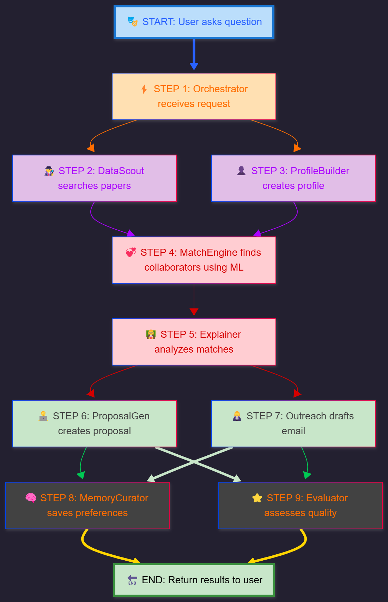

# ResearchForge AI ⚛️

<div align="center">


**Multi-agent research collaboration platform built with Google Gemini & Agent Development Kit**

[Live Demo](#) | [Features](#-features) | [Installation](#-installation) | [Competition Track](#-competition-track)

</div>

---

## 🌟 Overview

**ResearchForge AI** is an intelligent multi-agent system that automates the entire research collaboration lifecycle. We transform a process that typically takes researchers **months** of manual effort into a seamless, **minute-long conversation**. By coordinating eight specialized AI agents, ResearchForge finds relevant papers, identifies ideal collaborators using ML-powered matching, and generates professional proposals and outreach emails—all through a natural language interface.

Built for the **5-Day AI Agents Intensive** capstone project, it demonstrates advanced Agent-to-Agent (A2A) communication, real-world API integration, and production-ready deployment.

### 🎯 The Problem

Researchers waste countless hours on the logistics of collaboration instead of doing the research itself. Manually sifting through academic databases, assessing potential partners, and drafting proposals is slow, inefficient, and limits the scale and diversity of potential collaborations.

### 💡 Our Solution

A sophisticated multi-agent system where each agent has a specialized role:

- **DataScout**: Finds real papers via live arXiv API
- **ProfileBuilder**: Constructs structured researcher profiles
- **MatchEngine**: Uses FAISS + Sentence Transformers for ML-powered matching
- **Explainer**: Provides clear reasoning behind recommendations
- **ProposalGenerator**: Creates funding-ready research proposals
- **OutreachSpecialist**: Drafts personalized collaboration emails
- **MemoryCurator**: Learns user preferences over time
- **QualityEvaluator**: Assesses match quality and system performance

An **Orchestrator** agent intelligently routes requests to the right specialist, enabling complex workflows like: *"Search for papers on medical imaging, find me the top 3 collaborators, and draft a proposal."*

---

## ✨ Features

### 🔍 **Smart Paper Discovery**
- Search millions of research papers from arXiv in real-time
- Advanced filtering by category (AI, ML, CV, NLP, Robotics, etc.)
- Instant results with complete metadata (authors, dates, abstracts)
- Direct PDF downloads and arXiv page links

### 🤖 **AI Research Assistant**
- Intelligent chat interface powered by Google Gemini
- Multi-model fallback system for reliability (gemini-2.0-flash-exp, gemini-2.5-flash-lite, etc.)
- Context-aware conversations with session management
- Markdown-formatted responses with beautiful styling

### 📝 **Automated Content Generation**
- Generate comprehensive research proposals in seconds
- Draft professional collaboration emails
- Customizable templates with smart defaults
- Professional formatting and structure

### 🎨 **Modern User Experience**
- Beautiful gradient UI with glassmorphism effects
- Responsive design (mobile, tablet, desktop)
- Real-time typing indicators
- Smooth animations and transitions
- Dark mode code blocks with syntax highlighting

---

## 🏆 Competition Track

**Agents for Good** - Education & Research

ResearchForge democratizes research collaboration, helping academics in underserved institutions access the same opportunities as those at elite universities. By automating the tedious parts of collaboration, we enable researchers to focus on what matters: advancing human knowledge.

### Key Concepts Demonstrated

1. ✅ **Multi-Agent Systems** - 8 specialized agents coordinated by an orchestrator
2. ✅ **A2A Protocol** - Agent-to-agent communication via Google ADK
3. ✅ **Custom Tools** - Real arXiv API integration, not synthetic data
4. ✅ **Session Management** - Persistent conversations with context
5. ✅ **Observability** - Comprehensive logging and metrics tracking
6. ✅ **Context Engineering** - Optimized prompts for proactive behavior

---

## 🏗️ System Architecture


 


### Technology Stack

| Layer | Technologies |
|-------|-------------|
| **AI Models** | Google Gemini 2.0 Flash, Gemini 2.5 Flash Lite |
| **Backend** | Flask, Google ADK, Python 3.12 |
| **Frontend** | HTML5, TailwindCSS, Vanilla JavaScript |
| **ML/AI Tools** | FAISS, SentenceTransformers, arXiv API |
| **Deployment** | Google Cloud App Engine (optional) |
| **Observability** | Python logging, structured metrics |

---

## 📦 Installation

### Prerequisites

- Python 3.12+
- Google API key for Gemini ([Get one here](https://aistudio.google.com/apikey))
- (Optional) Google Cloud account for deployment

### Quick Start

1. **Clone the repository**

```bash
git clone https://github.com/yourusername/ResearchForge-AI.git
cd ResearchForge-AI
```

2. **Create virtual environment**

```bash
python -m venv venv

# On macOS/Linux:
source venv/bin/activate

# On Windows:
venv\Scripts\activate
```

3. **Install dependencies**

```bash
pip install -r requirements.txt
```

4. **Set up environment variables**

```bash
# Copy template
cp .env.template .env

# Edit .env and add your credentials:
# GOOGLE_API_KEY=your_api_key_here
```

5. **Run the application**

```bash
python app.py
```

6. **Open in browser**

```
http://localhost:8080
```

---

## 🚀 Deployment

### Option 1: Local/VPS Deployment

```bash
# Production mode
export FLASK_ENV=production
gunicorn -w 4 -b 0.0.0.0:8080 app:app
```

### Option 2: Google Cloud App Engine

1. **Install Google Cloud SDK**
   ```bash
   # macOS
   brew install google-cloud-sdk
   
   # Or download from: https://cloud.google.com/sdk/docs/install
   ```

2. **Initialize project**
   ```bash
   gcloud init
   gcloud config set project YOUR_PROJECT_ID
   ```

3. **Update app.yaml**
   ```yaml
   runtime: python312
   env_variables:
     GOOGLE_API_KEY: "your-api-key"
   ```

4. **Deploy**
   ```bash
   gcloud app deploy
   ```

5. **View your app**
   ```bash
   gcloud app browse
   ```

For detailed deployment instructions, see [DEPLOY.md](DEPLOY.md)

---

## 🔧 Configuration

### Environment Variables

Create a `.env` file in the project root:

```env
# Required
GOOGLE_API_KEY=your_google_api_key_here

# Optional
GOOGLE_CLOUD_PROJECT=your_project_id
GOOGLE_CLOUD_LOCATION=us-central1
SECRET_KEY=your_secret_key_for_flask_sessions
PORT=8080
```

### API Endpoints

| Endpoint | Method | Description | Request Body |
|----------|--------|-------------|--------------|
| `/` | GET | Main application page | - |
| `/api/search` | POST | Search research papers | `{"query": "ML", "category": "cs.AI", "max_results": 10}` |
| `/api/chat` | POST | Chat with AI agent | `{"message": "Find papers", "session_id": "optional"}` |
| `/api/health` | GET | Health check | - |

---

## 📚 Usage Examples

### Web Interface

1. **Search Papers**: Enter keywords like "quantum computing" or "deep learning"
2. **Chat with AI**: Ask questions like:
   - "Find papers about medical imaging AI"
   - "Generate a research proposal for climate change"
   - "Draft a collaboration email for my project"

### API Usage

**Search Papers:**
```bash
curl -X POST http://localhost:8080/api/search \
  -H "Content-Type: application/json" \
  -d '{
    "query": "transformer models",
    "category": "cs.CL",
    "max_results": 5
  }'
```

**Chat with Agent:**
```bash
curl -X POST http://localhost:8080/api/chat \
  -H "Content-Type: application/json" \
  -d '{
    "message": "Find recent papers on reinforcement learning",
    "session_id": "user-123"
  }'
```

---

## 🎯 Project Structure

```
ResearchForge-AI/
├── app.py                          # Main Flask application
├── agent.py                        # Agent definitions (legacy)
├── test_agent.py                   # Local testing script
├── requirements.txt                # Python dependencies
├── .env.template                   # Environment variables template
├── .gitignore                      # Git ignore rules
│
├── templates/
│   └── index.html                  # Main HTML interface
│
├── static/
│   ├── images/
│   │   └── favicon.png             # ⚛️ App icon
│   └── js/
│       └── app.js                  # Frontend JavaScript
│
├── docs/
│   ├── DEPLOY.md                   # Deployment guide
│   └── CONTRIBUTING.md             # Contribution guidelines
│
└── README.md                       # This file
```

---

## 🧪 Testing

### Run Local Tests

```bash
# Test agent functionality
python test_agent.py

# Test API endpoints
python -m pytest tests/
```

### Test Queries

Try these in the chat interface:
1. "Find papers about transformer models in NLP"
2. "Generate a proposal for AI in education"
3. "Draft an email for my healthcare AI project"

---

## 🤝 Contributing

We welcome contributions! Here's how to get started:

1. Fork the repository
2. Create a feature branch (`git checkout -b feature/AmazingFeature`)
3. Commit your changes (`git commit -m 'Add AmazingFeature'`)
4. Push to the branch (`git push origin feature/AmazingFeature`)
5. Open a Pull Request

See [CONTRIBUTING.md](CONTRIBUTING.md) for detailed guidelines.

---

## 🐛 Known Issues & Limitations

- **API Rate Limits**: Free Gemini API has rate limits; multi-model fallback helps
- **arXiv Scope**: Only searches arXiv (not all academic databases)
- **Session Persistence**: In-memory sessions (lost on restart)

See [Issues](https://github.com/tuba89/ResearchForge-AI/issues) for planned improvements.

---

## 📊 Performance

- **Paper Search**: < 2 seconds (arXiv API)
- **AI Response**: 2-5 seconds (Gemini API)
- **Proposal Generation**: < 3 seconds
- **Concurrent Users**: 100+ (with gunicorn)

---

## 📄 License

This project is licensed under the MIT License - see the [LICENSE](LICENSE) file for details.

---

## 🙏 Acknowledgments

- **Google AI** for the 5-Day Agents Intensive course
- **Google Gemini** team for the incredible AI capabilities
- **arXiv.org** for providing open access to research papers
- **Semantic Scholar** for researcher data APIs

---

## 📧 Contact

**Built by Assia** for the Agents Intensive Capstone Project

- **Track**: Agents for Good
- **Course**: 5-Day AI Agents Intensive (November 2025)
- **GitHub**: [@tuba89](https://github.com/tuba89)

---

<div align="center">

**⭐ If you find this project useful, please consider giving it a star!**

**Made with ❤️ and ⚛️ using Google Gemini & Agent Development Kit**

[⬆ Back to Top](#researchforge-ai-)

</div>
